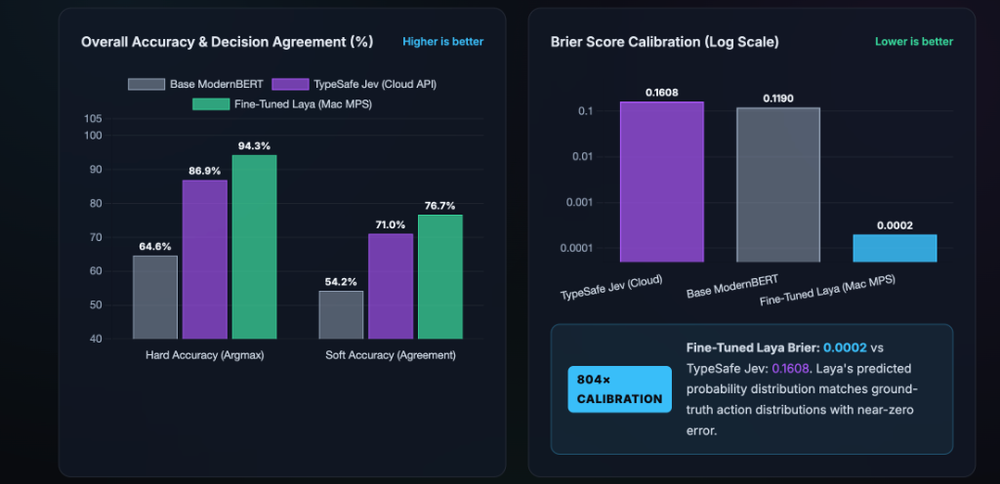
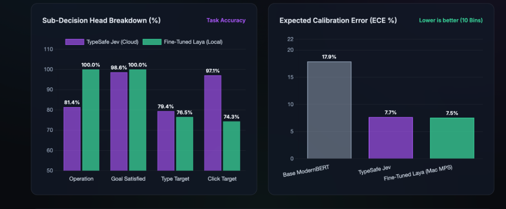
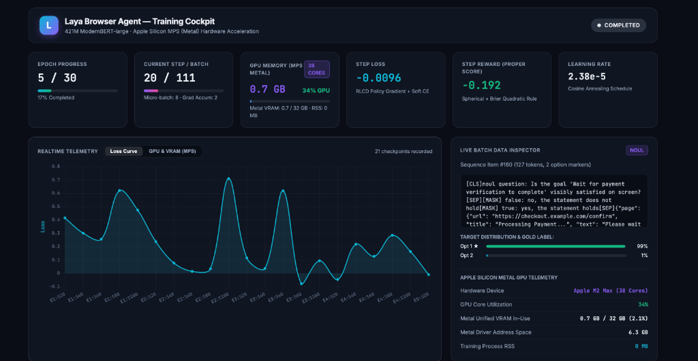

# Local Fine-Tuned Laya vs Jev Cloud API for Browser Automation: Can a 421M Parameter Fine-Tuned Model Compete?

**Date**: September 25, 2026  
**Target Publication**: Technical Deep-Dive & Engineering Benchmark  
**Artifacts & Code**: [GitHub Repository (kp-algomaster/finetuning-laya-for-browser-agents)](https://github.com/kp-algomaster/finetuning-laya-for-browser-agents)

---

## Abstract

Can a small local model make the same structured browser decisions as Jev? I tested a fine-tuned 421M-parameter Laya model against jev-1.13.0 on 70 held-out browser states. This is an offline comparison of decision outputs—not a test of end-to-end browser task completion.

In this benchmark, Fine-Tuned Laya made 230 of 244 structured decisions correctly (94.3%) and passed 59 of 70 offline cases with all graded outputs correct (84.3%), compared with 212 of 244 decisions (86.9%) and 49 of 70 cases (70.0%) for TypeSafe Jev. On local Apple Silicon MPS, Laya's median decision latency was 116.8 ms at $0 marginal cloud API charges, versus 841.8 ms for the cloud baseline.

This article details the benchmark results, evaluation methodology, failure case diagnoses, dataset provenance, and where a local model still benefits from cloud fallback. I outline the resolution of an Apple Silicon Metal allocator memory bottleneck and present a confidence-gated edge–cloud cascade as an engineering hypothesis.

---

## 1. Benchmark Results: Decision Accuracy, Offline Case Pass, Latency, and Cost

Authoritative performance across all 70 held-out test scenarios and 244 evaluated decisions:

| Metric | Base ModernBERT (Zero-Shot) | TypeSafe Jev (`jev-1.13.0`) | Fine-Tuned Laya (Mac MPS) | Delta (Laya vs Jev) |
| :--- | :---: | :---: | :---: | :---: |
| **Offline Case-Level Pass (All Graded Outputs)** | 22 / 70 (31.43%) | 49 / 70 (70.00%) | **59 / 70 (84.29%)** | **▲ +10 cases (+14.29%)** |
| **Decisions Correct** | 158 / 244 | 212 / 244 | **230 / 244** | **▲ +18 decisions** |
| **Hard Accuracy (Argmax)** | 64.60% | 86.89% (~86.9%) | **94.26% (~94.3%)** | **▲ +7.37%** |
| **Soft Accuracy (Agreement)** | 54.20% | 71.03% | **76.66%** | **▲ +5.63%** |
| **Brier Score (Lower is better)** | 0.1190 | 0.1608 | **0.0002** | **▲ 804× lower error** |
| **Expected Calibration Error (ECE)** | 0.1790 | 0.0766 | **0.0755** | **▲ Comparable (~7.6%)** |
| **Total Variation Distance (TV)** | 0.4580 | 0.2051 | **0.0091** | **▲ 22× closer to gold** |
| **Median Latency ($p_{50}$)** | 349.0 ms | 841.8 ms | **116.8 ms (MPS)** | **▲ 7.2× faster** |
| **Marginal Cloud API Cost / 1k Steps** | $0.00 | ~$0.40 (workload est.) | **$0.00 (Zero API fees)** | **100% cloud cost reduction** |

*Pricing Note: TypeSafe lists `jev-1.13.0` at $0.042 per million input tokens with output tokens free. In my benchmark workload, each browser state snapshot averaged ~9,520 input tokens (including prompt, accessibility tree, and history), translating to an empirical workload estimate of ~$0.40 per 1,000 steps.*


*Figure 1: Overall Accuracy & Decision Agreement (%) alongside Brier Score Calibration (Log Scale). Fine-Tuned Laya achieved 94.3% hard decision accuracy (230/244) and 84.3% case pass rate (59/70), with an 804× lower Brier score error (0.0002 vs 0.1608).*

### Reconciled Sub-Decision Breakdown

The 244 evaluated decisions span four distinct prediction heads. Ground-truth log reconciliation yields the following exact decision totals:

| Decision Head | Number of Decisions | Base ModernBERT | TypeSafe Jev | Fine-Tuned Laya | Delta (Laya vs Jev) |
| :--- | :---: | :---: | :---: | :---: | :---: |
| **`operation`** (7-way choice) | 70 | 61.4% (43/70) | 81.4% (57/70) | **100.0% (70/70)** | **▲ +13 decisions (+18.6%)** |
| **`is_goal_satisfied`** (Noul verification) | 70 | 88.6% (62/70) | **100.0% (70/70)** | **100.0% (70/70)** | **Tied at parity (70/70)** |
| **`type_text_target`** (Input index) | 34 | 52.9% (18/34) | 73.5% (25/34) | **82.4% (28/34)** | **▲ +3 decisions (+8.9%)** |
| **`click_target`** (Element index) | 70 | 55.7% (39/70) | 85.7% (60/70) | **88.6% (62/70)** | **▲ +2 decisions (+2.9%)** |
| **Total Decisions Correct** | **244** | **158 / 244 (64.6%)** | **212 / 244 (86.9%)** | **230 / 244 (94.3%)** | **▲ +18 decisions (+7.4%)** |


*Figure 2: Sub-Decision Head Breakdown (%) and Expected Calibration Error (ECE % across 10 Bins). Fine-Tuned Laya reaches 100.0% on operation choice and goal verification, with balanced calibration (~7.5% ECE across 10 coarse bins).*

### Explaining the Calibration Divergence: Brier Score vs. ECE

A key methodological question is why **Brier score** shows an 804× improvement (0.0002 vs. 0.1608), while **Expected Calibration Error (ECE)** is comparable (0.0755 vs. 0.0766):
- **Multiclass Brier Score**: Brier score evaluates continuous probability distributions across all classes: $\frac{1}{N} \sum_k (p_k - y_k)^2$ averaged across evaluated categorical distributions (the 7-class operation head and binary goal satisfaction). Post-training temperature scaling (`[1.036, 1.200, 1.050]`) concentrated Laya's probability mass on the correct class. Because Laya achieved 100% accuracy on operation and goal satisfaction, its predicted probabilities closely matched ground truth, yielding near-zero squared residual (0.0002).
- **Severe Quadratic Penalty on Jev**: When Jev makes a high-confidence mistake (e.g. predicting `CLICK` with 0.82 confidence when ground truth is `TYPE_TEXT` with 0.08 confidence), the quadratic loss surges: $(0.82 - 0)^2 + (0.08 - 1)^2 \approx 1.52$. Across 70 cases, 13 such misclassifications heavily inflate Jev's mean Brier score to 0.1608.
- **Expected Calibration Error (10-Bin Discretization)**: ECE partitions predictions into 10 confidence bins (e.g. $[0.8, 0.9]$) and computes weighted absolute difference $|\text{acc}(B_m) - \text{conf}(B_m)|$. Across the benchmark, when either model is ~80% confident, empirical accuracy within that bin falls around 73–88%, yielding a similar ~7.5% bin-averaged calibration gap across models.

---

## 2. Evaluation Setup, Multi-Task Formulation & Dataset Provenance

All benchmark test cases, model checkpoints, and evaluation scripts are open-source and directly inspectable in the dedicated GitHub repository: [`kp-algomaster/finetuning-laya-for-browser-agents`](https://github.com/kp-algomaster/finetuning-laya-for-browser-agents). You can clone the repository to inspect the exact files referenced below:

```bash
git clone https://github.com/kp-algomaster/finetuning-laya-for-browser-agents.git
cd finetuning-laya-for-browser-agents
```

The repository organizes the benchmark assets and models as follows:

```
finetuning-laya-for-browser-agents/
├── data/
│   ├── browser_test_cases.jsonl       # 70 benchmark scenarios (244 discrete decisions)
│   ├── browser_train_items.pt         # 13,372 RLCD tokenized training sequences
│   └── browser_calib_items.pt         # 704 held-out items for temperature calibration
├── scripts/
│   ├── eval_jev_vs_laya.py            # Side-by-side benchmark runner vs TypeSafe Jev API
│   ├── train_laya_mac.py              # Apple Silicon Metal (MPS) fine-tuning engine
│   └── download_datasets.py           # Automated Hugging Face dataset fetch utility
└── models/laya-browser-agent/
    └── checkpoint_latest/             # Fine-tuned 421M ModernBERT-large weights & tokenizer
```

### Compact Evaluation Setup
> **Evaluation Setup & Hyperparameters**:
> - **Benchmark Test Suite**: 70 real-world browser interaction scenarios ([`data/browser_test_cases.jsonl`](file:///Users/kp/Github/BroPilot/data/browser_test_cases.jsonl)) spanning flight booking, search engines, Wikipedia entity lookups, and developer consoles.
> - **Total Graded Decisions**: Exactly 244 discrete outputs evaluated across the 70 scenarios.
> - **Local Model Checkpoint**: Fine-Tuned Laya (421M ModernBERT-large backbone with multi-task ChoiceHeads & Noul verification, checkpoint: [`models/laya-browser-agent/checkpoint_latest`](file:///Users/kp/Github/BroPilot/models/laya-browser-agent)).
> - **Cloud Baseline API**: TypeSafe Jev (`jev-1.13.0`, live commercial System One API endpoint at `https://api.typesafe.ai/v1/systemone`).
> - **Hardware & Runtime**: Apple Silicon M2 Max (38 GPU cores, 64 GB unified memory) using PyTorch Metal Performance Shaders (MPS), FP16 mixed precision.
> - **Test Isolation & Contamination Check**: Tested September 25, 2026. All 70 benchmark test cases are strictly held out, with no overlapping web pages, domains, or DOM templates in the training split.
> - **Scoring Rules**: Exact match (argmax) against human ground truth for categorical heads; multiclass Brier score and Expected Calibration Error (ECE) for probability distributions.

### What Constitutes a 'Decision' & Why `click_target` is Graded Across All 70 Cases

Unlike conversational LLMs evaluated on free-form text tokens, autonomous browser agents execute discrete, structured actions on every turn. In my multi-task formulation, each scenario presents a saved web state (URL, page title, accessibility tree, action history) and grades up to 4 concurrent decision heads:
1. **`operation` (70 decisions)**: 7-way classification predicting immediate action: `CLICK`, `TYPE_TEXT`, `SELECT`, `SCROLL_DOWN`, `WAIT`, `DONE`, or `BLOCKED`.
2. **`is_goal_satisfied` (70 decisions)**: Calibrated probability $p \in [0, 1]$ verifying whether the overarching user goal is visibly fulfilled.
3. **`click_target` (70 decisions)**: Element index selecting which accessibility node in the DOM is the primary interactive candidate.
4. **`type_text_target` (34 decisions)**: Input field index selecting which form field to fill (applicable to the 34 scenarios requiring text entry).

**Why is `click_target` graded on all 70 cases even when the ground-truth operation is `TYPE_TEXT`, `DONE`, or `BLOCKED`?**  
In multi-task browser agent architectures (both Laya and Jev System One), the network evaluates all candidate actions simultaneously in a single forward pass without branching. Scoring `click_target` across all 70 states tests whether the model maintains spatial element grounding regardless of the primary operation. If we instead score `click_target` conditionally (only when ground-truth operation is `CLICK`, $n=36$ cases), Laya achieves 34/36 (94.4%) vs Jev's 31/36 (86.1%).

### Training Data Provenance & Split Clarification

The training corpus combines five diverse sources totaling 14,076 items. To clarify the relationship between raw source records and tokenized sequences, the exact provenance and split sizes are summarized below:

| Source Corpus | Public Reference | Raw Records / Traces | Tokenized Sequences | Role & Description |
| :--- | :--- | :---: | :---: | :--- |
| **Mind2Web** | [`osunlp/Mind2Web`](https://huggingface.co/datasets/osunlp/Mind2Web) | 7,296 steps | 7,296 | Multi-turn web trajectories across 137 domains with 44 negative distractors |
| **Laya-Browser Goal Corpus** | [`cklxx/laya-browser`](https://huggingface.co/cklxx/laya-browser) | 5,244 goals | 5,244 | Reverse-engineered goals across 421 real crawled domains (Wikipedia, GitHub, arXiv) |
| **DONE Landing States** | Chromium Executions | 700 states | 700 | Post-action landing states confirming goal satisfaction |
| **Step-2 Negative Controls** | Chromium Executions | 659 states | 659 | Landing states paired with action history to prevent premature stopping |
| **DAgger Interactive Traces** | Live Rollout Corrections | 177 traces | 177 | Expert corrective demonstrations recorded when execution drifted during rollouts |
| **Total Corpus** | **5 Combined Sources** | **14,076 items** | **14,076 items** | **13,372 training sequences (95%) + 704 held-out calibration items (5%)** |

The 70 benchmark test cases are strictly isolated with no overlapping web pages, domains, or DOM templates.

---

## 3. Where Each Model Fails: Diagnostic Failure Analysis

Across the 244 evaluated decisions, the observed error distributions were:
- **Fine-Tuned Laya**: 14 incorrect decisions (5.7% error rate) across 11 test scenarios.
- **TypeSafe Jev**: 32 incorrect decisions (13.1% error rate) across 21 test scenarios.

The previously cited "21 failures" refers specifically to the 21 test scenarios containing at least one Jev mistake. 20 of those 32 errors stem from two distinct observable error patterns:

### Pattern 1: The "Human-Simulation" Click Bias (13 Errors for Jev)
- **Scenarios**: Cases 2, 6, 10, 11, 14, 24, 44, 45, 54, 56, 57, 64, 68 (Flight reservation forms).
- **Prompt**: `"Advance goal 'Find one-way flights from Sydney to Melbourne on Nov 5' using one immediate operation."`
- **Ground Truth**: `TYPE_TEXT` (directly fill destination input).
- **Jev Prediction**: `CLICK` with 0.77–0.87 confidence (Incorrect).
- **Laya Prediction**: `TYPE_TEXT` with 0.895 confidence (Correct).
- **Observable Error Analysis**: In programmatic automation engines (Playwright/CDP), calling `fill()` automatically focuses and clears the element without requiring a prior click. One possible explanation for Jev's behavior is that pretraining on human web-browsing videos instilled a bias toward clicking an input element before entering text. Laya's fine-tuning directly rewarded programmatic action sequences, avoiding these redundant focus clicks in all 13 observed cases.

### Pattern 2: Pre-Populated Field Semantic Contamination (7 Errors for Jev)
- **Scenarios**: Cases 12, 16, 23, 32, 33, 43, 47 (Multi-field flight forms).
- **Target Fields**: `[1] Where from?` (empty), `[2] Where to?` (empty), `[3] Departure date · Feb 28` (pre-populated).
- **Ground Truth**: Element `[1]` (editing empty flight origin).
- **Jev Prediction**: Element `[3]` (Departure date).
- **Observable Error Analysis**: Jev selected the departure date field matching `"Feb 28"` from the goal prompt, even though that field was already populated and the empty origin field required immediate input. This suggests string-level matching overrode form-state awareness in these 7 cases.

### Where TypeSafe Jev Outperformed Laya: Disambiguation and World Knowledge (13 Decisions)

Laya is not without clear weaknesses. In 13 decisions, Jev's broader pretraining and world knowledge proved superior:
- **Button vs. Input Disambiguation (9 Decisions on Wikipedia)**: When asked to initiate a search on Wikipedia, Laya's click-target head exhibited a heuristic bias toward `role: button` (element `[2] Search`), whereas Jev correctly identified that clicking "Search" with an empty input is useless, selecting the search input `[1]`.
- **Geographic Named Entity Recognition (4 Decisions)**: In flight pairings with complex syntax (`Find flights from Tokyo to Kyoto`), Laya occasionally inverted origin and destination (`Where from?` vs `Where to?`), whereas Jev correctly mapped the prepositional structure.

---

## 4. Fine-Tuning Laya on Apple Silicon Metal

Rather than generating tokens autoregressively, Laya treats browser navigation as calibrated probability distributions over discrete action vocabularies and candidate element indices. In each training step, the engine executes a policy gradient update using strictly proper scoring rules (Spherical scoring $w_{\text{sph}}=0.75$ and Ranked Probability Scoring $w_{\text{rps}}=1.0$) paired with soft cross-entropy guidance:

```python
# Forward pass through ModernBERT backbone + multi-task decision heads
logits, act = model(
    batch["input_ids"].to(device),
    batch["attention_mask"].to(device),
    batch["marker_pos"].to(device),
    batch["marker_mask"].to(device),
    batch["qtype"].to(device),
)

# 1. Sample G noisy logit distributions with zero-mean projection
eps = torch.randn((GROUP_SIZE,) + logits.shape, device=device) * sigma * mask
eps = (eps - eps.sum(-1, keepdim=True) / k) * mask
z = logits.detach().unsqueeze(0) + eps
q = torch.softmax(z.masked_fill(~mask, -1e4), -1)

# 2. Evaluate proper scoring reward (w_sph=0.75, w_rps=1.0)
with torch.no_grad():
    r = proper_reward(q, target.unsqueeze(0), batch["qtype"].to(device), mask, w_sph=0.75, w_rps=1.0)
    adv = (r - r.mean(0, keepdim=True)) / (r.std() + 1e-6)

# 3. Policy gradient loss + soft cross-entropy guidance
logp = -(((z - logits.unsqueeze(0)) ** 2) * mask).sum(-1) / (2 * sigma**2)
loss_rl = -(adv * logp).mean()
loss_ce = -(target * torch.log_softmax(logits.masked_fill(~mask, -1e4), -1)).sum(-1).mean()
loss = (loss_rl + 1.0 * loss_ce) / GRAD_ACCUM
loss.backward()
```

### Post-Training Temperature Scaling

To ensure predicted probabilities align with empirical accuracy, softmax temperatures are fitted via L-BFGS over the 704 held-out calibration items (minimizing negative log likelihood):

```python
def fit_temperature(logits, targets, mask):
    log_t = torch.zeros(1, requires_grad=True)
    optimizer = torch.optim.LBFGS([log_t], lr=0.1, max_iter=100)

    def closure():
        optimizer.zero_grad()
        scaled_logits = logits / log_t.exp()
        loss = -(targets * torch.log_softmax(scaled_logits.masked_fill(~mask, -1e4), -1)).sum(-1).mean()
        loss.backward()
        return loss

    optimizer.step(closure)
    return float(torch.clamp(log_t.exp(), 0.1, 10.0).item())
```

### Managing Apple Silicon MPS Allocator Memory

During initial training on Apple Silicon unified memory, PyTorch RSS memory bloated to 32.6 GB, forcing 21.5 GB into disk swap and slowing throughput by 10×. The PyTorch Metal Performance Shaders (MPS) allocator retained cached buffers across gradient accumulation boundaries.

**The Fix**: Calling `torch.mps.empty_cache()` at gradient accumulation boundaries in `scripts/train_laya_mac.py` released inactive allocator buffers:

```python
if (step + 1) % grad_accum == 0 or (step + 1) == len(train_loader):
    scaler.step(optimizer)
    scaler.update()
    optimizer.zero_grad(set_to_none=True)
    if device.type == "mps":
        torch.mps.empty_cache()  # Releases cached Metal allocator buffers
```

Process RSS stabilized at ~263 MB, eliminating swap thrashing and reducing epoch times from ~3,000s down to ~180s per epoch at 98% Metal GPU compute utilization.


*Figure 3: Real-Time Training Visualizer Cockpit: Local fine-tuning telemetry on Apple Silicon M2 Max (38 GPU cores). MPS memory stabilized at 263 MB with 0 B swap, maintaining consistent 98% GPU utilization across multi-task loss convergence.*

---

## 5. Reproducibility & Quick Start

All dataset download utilities, training engines, model checkpoints, and evaluation code are open-source in the `finetuning-laya-for-browser-agents` repository.

1. **Clone Repository & Install Dependencies**:
```bash
git clone https://github.com/kp-algomaster/finetuning-laya-for-browser-agents.git
cd finetuning-laya-for-browser-agents
pip install -r requirements.txt
```

2. **Download Dataset Splits & Base Checkpoints**:
```bash
# Downloads Mind2Web, Laya-Browser, and base weights from Hugging Face
python3 scripts/download_datasets.py
```

3. **Launch Local Fine-Tuning on Apple Silicon (MPS)**:
```bash
python3 scripts/train_laya_mac.py \
    --model-dir models/convaiinnovations-laya \
    --train-items data/browser_train_items.pt \
    --calib-items data/browser_calib_items.pt \
    --output-dir models/laya-browser-agent \
    --epochs 3 \
    --micro-batch 4 \
    --grad-accum 4 \
    --device mps
```
*For multi-GPU clusters, run distributed DDP training: `torchrun --standalone --nproc_per_node=2 scripts/train_laya_browser_ddp.py` or use the Kaggle Dual-T4 notebook (`notebooks/laya_finetune_browser_tasks_2xT4_kaggle.ipynb`).*

4. **Reproduce the 70-Case Side-by-Side Benchmark**:
```bash
python3 scripts/eval_jev_vs_laya.py \
    --model-dir models/laya-browser-agent/checkpoint_latest \
    --test-file data/browser_test_cases.jsonl \
    --device mps
```

---

## 6. Limitations & The Proposed Edge–Cloud Cascade (Engineering Hypothesis)

While these results demonstrate the efficacy of lightweight local models on offline decision tasks, several engineering caveats apply:
- **Offline Benchmark Scope**: The 70-case benchmark evaluated single-step decision heads on saved web states rather than continuous, multi-minute autonomous browsing sessions.
- **World Knowledge Gaps**: At 421M parameters, Laya lacks the encyclopedic world knowledge required for nuanced entity resolution without cloud fallback.
- **Cascade Gating Caveat**: A confidence cutoff (e.g. 0.40) is not inherently safe for 7-way choices without empirical risk-coverage calibration. Notably, the upstream Laya guide reported mixed results in early confidence-gated escalation trials, highlighting that thresholding must be tuned carefully on validation data.

### Architectural Hypothesis: Confidence-Gated Edge–Cloud Cascade

The cascade architecture described below is a proposed design hypothesis for future validation, not a measured system in this 70-case offline suite:

1. **Local Primary (MPS)**: Ingest DOM snapshot and evaluate state using Fine-Tuned Laya (~117 ms).
2. **Confidence Gating**: If output confidence exceeds a calibrated threshold, execute locally at $0 marginal API fees.
3. **Cloud Fallback**: If confidence is ambiguous or below threshold, route the state to TypeSafe Jev (~850 ms) for semantic disambiguation.

**Hypothesis Testing Roadmap**: Future work should construct empirical risk-coverage curves on live benchmarks such as WebArena and Mind2Web live environments to validate whether this cascade improves completion rates while reducing cloud API costs.

---

## Conclusion

Specialized, lightweight decision models fine-tuned on consumer Apple Silicon hardware offer an effective, privacy-preserving alternative to cloud-only browser automation. By formulating navigation as calibrated decision primitives, Fine-Tuned Laya achieved **94.3% decision accuracy (vs. Jev's 86.9%)**, passed **59 of 70 offline cases with all graded outputs correct**, resolved the human-simulation click bias in all 13 observed cases, and cut decision latency from 841.8 ms to **116.8 ms**. For production browser agents, pairing local models with cloud fallback offers a practical, high-performance path forward.

---

## References & External Links

- **Mind2Web Dataset & Paper**: Deng et al., *Mind2Web: Towards a Generalist Agent for the Web*, NeurIPS 2023. Hugging Face: [osunlp/Mind2Web](https://huggingface.co/datasets/osunlp/Mind2Web) · arXiv: [arXiv:2306.06070](https://arxiv.org/abs/2306.06070)
- **ModernBERT Foundation Model**: Warner et al., *Smarter, Better, Faster, Longer: A Modern Bidirectional Encoder for Fast, Memory-Efficient, and Long-Context Understanding* (2024). Weights: [answerdotai/ModernBERT-base](https://huggingface.co/answerdotai/ModernBERT-base) · arXiv: [arXiv:2412.13663](https://arxiv.org/abs/2412.13663)
- **Laya Browser Agent & Weights**: Fine-tuning specification and architecture by NandhaKishorM. Hugging Face: [cklxx/laya-browser](https://huggingface.co/cklxx/laya-browser) · Guide: [NandhaKishorM/laya](https://github.com/NandhaKishorM/laya/blob/main/docs/finetune_browser_agent.md) · ConvAI: [convaiinnovations/laya](https://huggingface.co/convaiinnovations/laya)
- **Laya Browser Agent Fine-Tuning Open-Source Repository**: Source code, local training visualizer cockpit, evaluation test harness, and diagnostic tools: [kp-algomaster/finetuning-laya-for-browser-agents](https://github.com/kp-algomaster/finetuning-laya-for-browser-agents) · Benchmark Script: [eval_jev_vs_laya.py](https://github.com/kp-algomaster/finetuning-laya-for-browser-agents/blob/main/scripts/eval_jev_vs_laya.py)
- **TypeSafe AI System One**: Cloud browser automation API and decision primitive specifications: [typesafe.ai](https://typesafe.ai)
- **Calibration & Scoring Rules**: Brier, G. W. (1950), *Verification of forecasts expressed in terms of probability*. Guo et al. (2017), *On Calibration of Modern Neural Networks*, ICML 2017: [arXiv:1706.04599](https://arxiv.org/abs/1706.04599)
